# Cryptocurrencies

## Overview

Martha, a senior manager for the Advisory Services Team at Accountability Accounting, is excited to pitch an investment in crypto currencies to her firm. Since the company is lost in the vast universe of crypotocurrencies, the project aims to create a report that includes what cryptocurrencies are on the trading market and how they could be grouped to create a classification system. The data does not have any known outcome, so there is a need to preprocess and fit it to Unsupervised Machine Learning model as below:
- Preprocess the data for PCA.
- Reduce Data Dimensions Using Principal Component Analysis(PCA).
- Cluster Cryptocurrencies Using K-means.
- Determine the best number of centroids for K-means using the elbow curve.
- Visualize Cryptocurrencies Results.

## Resources

- scikit-learn
- Plotly Express
- hvPlot 0.0.8
- Pandas

## Results

### Preprocessing the data for PCA

- The original dataset has 1,252 entries, however only 1,144 cryptocurrencies are currently trading.
<table>
  <tr>
    <td>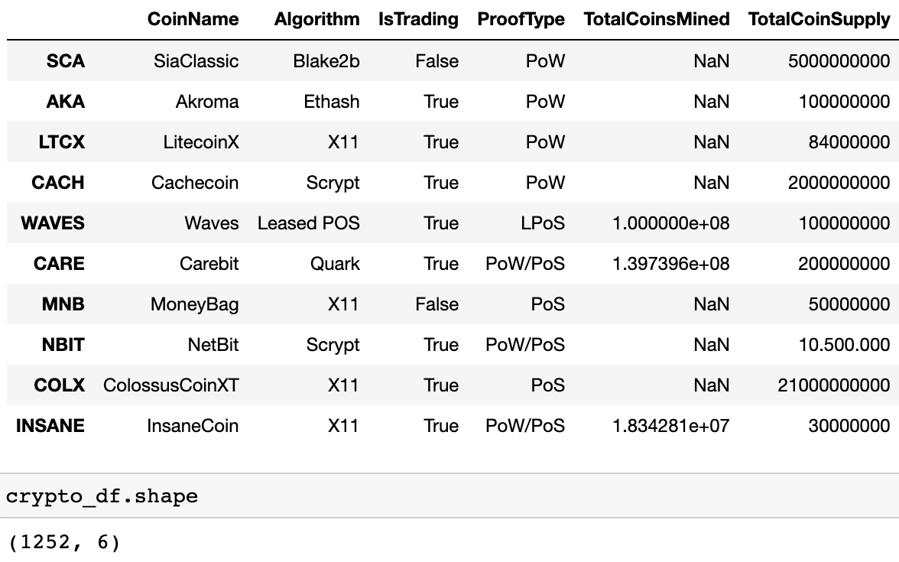</td>
    <td>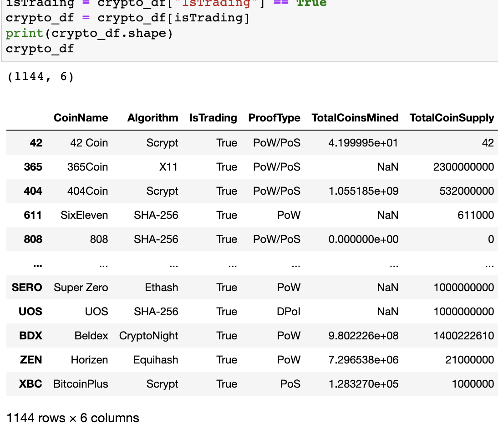</td>
  </tr>
</table>

- The data is further munged to remove null values to get a count of 685 entries. Later, cryptocurrencies that have a total number of mined coins greater than 0 are considered. The final results show 532 tradable cryptocurrencies.
<table>
  <tr>
    <td>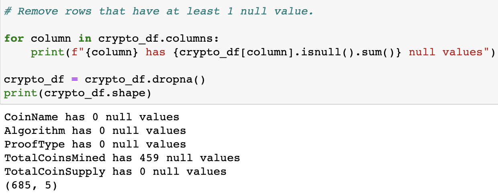</td>
    <td>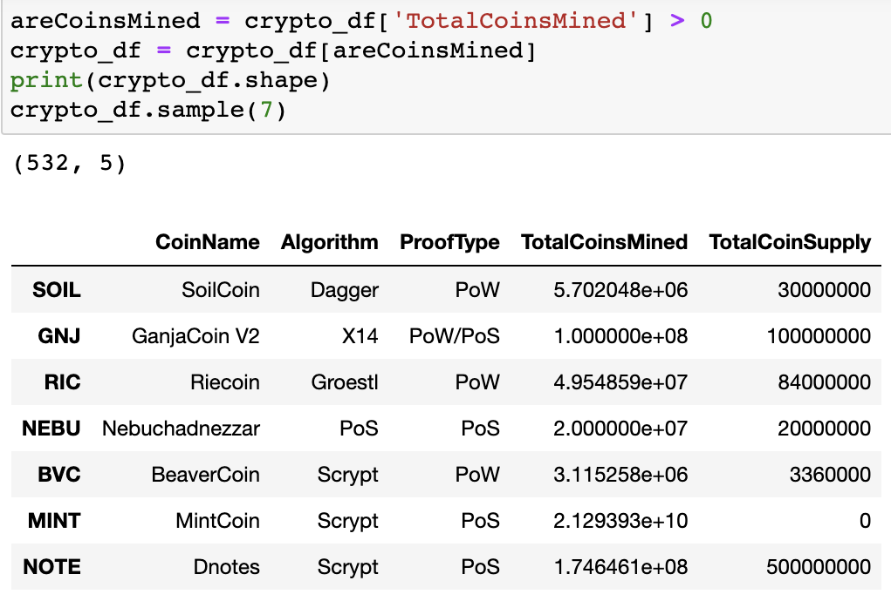</td>
  </tr>
</table>

### Reducing data dimensions using PCA
- After converting the categorical variables to indicator variables and standardizing features by scaling to unit variance, the dimensions of the resulting data frame are reduced to three principal components.  
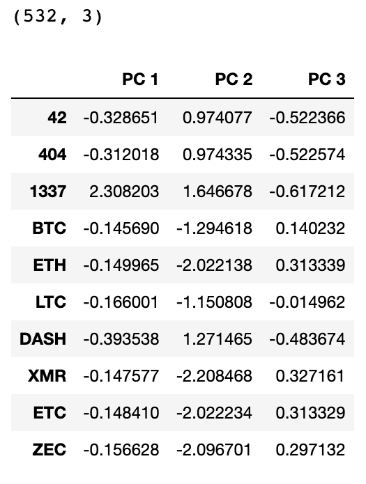

- To explain how much variation in a dataset can be attributed to each of the principal components generated by the PCA method, explained variance is calculated. The explained variance of the three components sums up to 6.98% of the information, which is very low. This tells that over 93% of information is lost in dimensionality reduction.
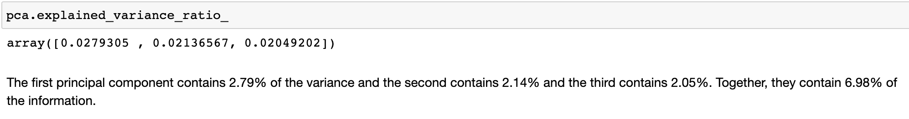

### Clustering Crytocurrencies Using K-Means
- To determine the best value for K, Elbow curve is plotted. The curve shows 4 at the elbow. This is the number of clusters that is used for the KMeans algorithm.
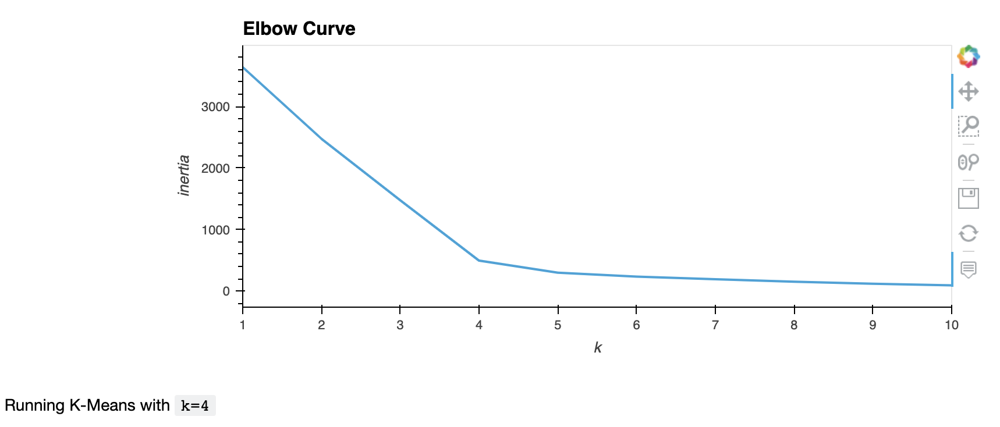

- Upon fitting data to K-Means model, the predictions are shown under "Class" column and the resultant dataframe looks like below:
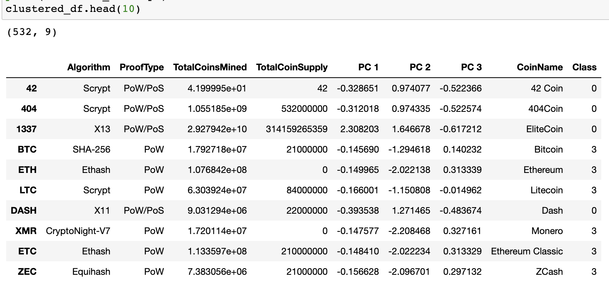

### Visualizing Cryptocurrencies Results
- The distinct groups that correspond to the three principal components are plotted in a 3D scatter plot for visualization. There are three major clusters and fourth cluster has only one data point. This implies that KMeans segregated an extreme value in its own cluster to reduce variance.
- KMeans algorithm is sensitive to outliers. Removing outliers in data and then clustering may produce better results.
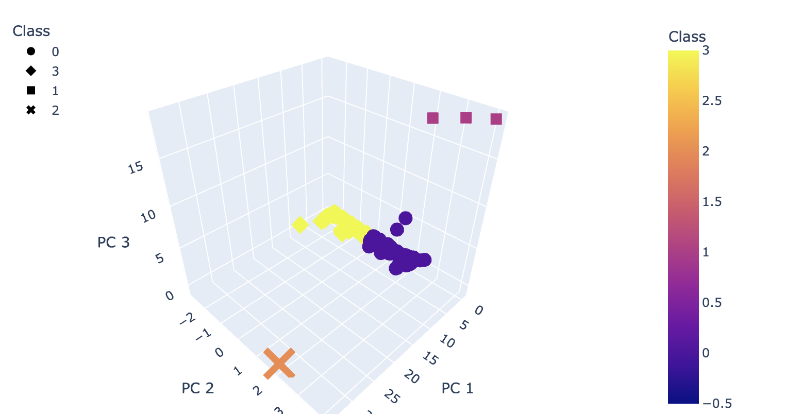

- With the clusters generated, the data is presented in a table using hvPlot. There are 532 tradable cryptocurrencies.
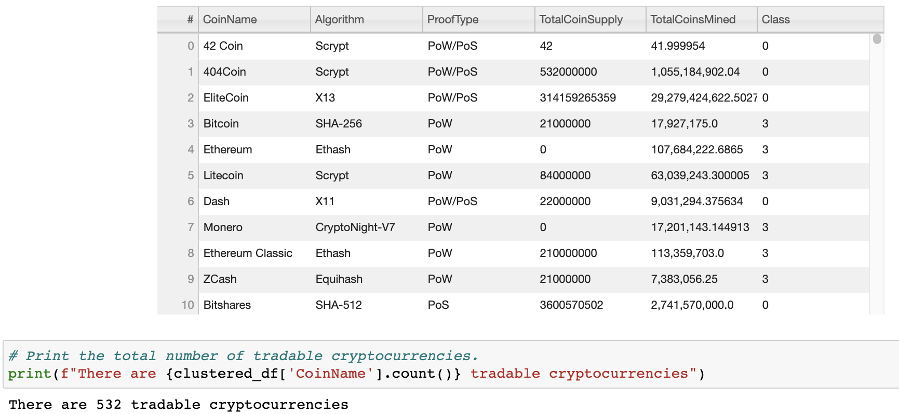

- The TotalCoinSupply and TotalCoinsMined columns are scaled between the given range of zero and one. The scaled data is added to the clustered data to create a scatter plot. Two outliers can be observed at the top left and right corners of the plot. 
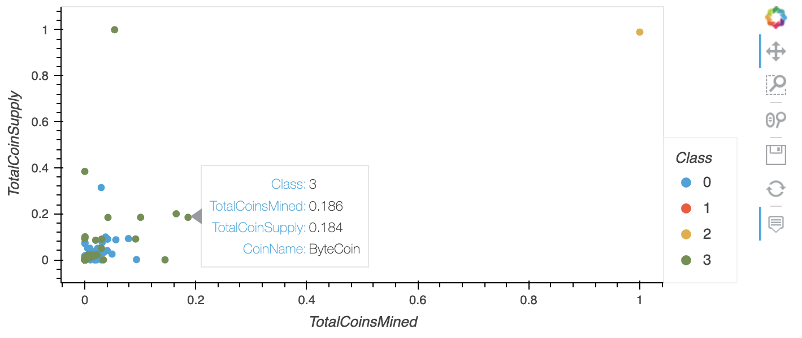

## Summary
Employing unsupervised machine learning models to discover patterns in crypto data is the way to go. The analysis is successful in grouping the data into four clusters. However, inorder to create a crypto investment portfolio, the below points should considered for further analysis:
- PCA generated a low explained variance, which can tell that a variable of significant effect has been omitted from the noise reduction procedure. Since variability is too low, increasing the number of components as input for PCA may be considered to produce a robust scheme for groups.
- The KMeans algorithm assigned a single element to a single cluster. It may imply the cryptocurrency dataset has some dirty data. Checking for and removing outliers in data and then clustering may produce better results. Alternatively, if the data does not show many outliers, another algorithm can be used instead of KMeans for clustering.
- Similarly, plotting the clustered cryptos by total supply and mined coins shows two outliers. This strongly suggests the need to clean data and run the models.

### References
Thomas A. Runkler, Data Analytics - Models and Algorithms for Intelligent Data Analysis, 2nd Edition
